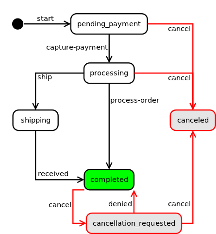

# UPPSELL

A Python-Flask API to business objects relating to e-commerce and a django-backed
admin for managing them.

## Features

- Order and payment workflows allow you to assign custom callbacks at different
  stages of the order cycle, such as:
  - provision a service only once a payment is made
  - check that a transition can be made
  - generate an invoice
  - email a customer

### Order workflow diagram

### Payment workflow diagram

## Legal
- License: [MIT](LICENSE.txt)
- Copyright: Copyright © 2014 [yuilop SL](http://yuilop.com)
